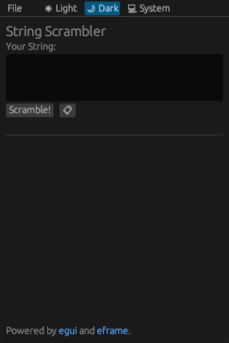

# String Scrambler

  

This is a modified repo of the template repo for [eframe](https://github.com/emilk/eframe_template) which is a framework for writing apps using [egui](https://github.com/emilk/egui/)

## Additions
The String Scrambler takes user input from the multi-line text box and scrambles it with the press of a button. The output is then easily fetched by pressing the `copy to clipboard` button.

---

  

